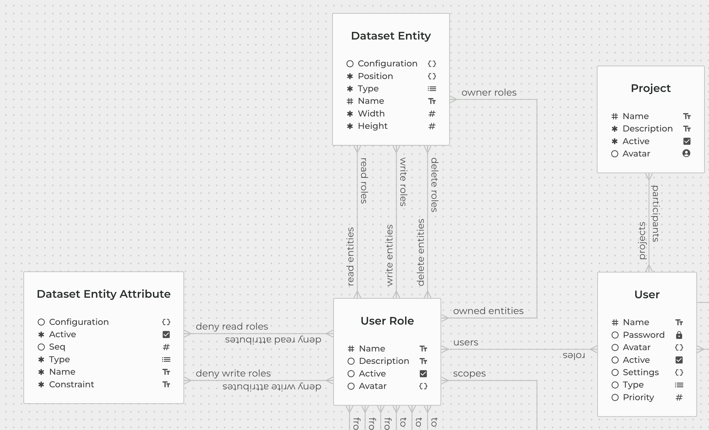

<p align="end"></div>

The **EYWA project** is a fusion of **Identity Access Control** through OAuth2.1 (+OIDC) and deployable, exportable, transportable **Data Models**. Once deployed, these models are immediately exposed through **generic GraphQL queries and mutations**.


#### Why?

Because it makes my day better. It won't fit every situation or scenario, but it can contribute at any point. Starting a new project often comes with repetitive requirements: **user management** and **database design**. Why not handle both simultaneously to take you as far as possible, as quickly as possible?

This is all available through a **graphical UI**. Visualizing how your data is structured, understanding relationships, and being able to share this view with your teammates ensures the entire team is on the same page. This process has led to **unexpected enhancements** and saved us from many **dead-end ideas**.

When expanding the scope or redesigning data "tables" and "columns" don’t you want to see the impact your changes will have? Wouldn't it be better to see the differences between the current database state and the proposed future state? Do you really want to manually add or alter tables and columns?


#### How?

The idea is simple: it all starts with **data modeling**. Data models consist of **entities** and **relations**, represented as Clojure records that implement protocols defined in the `neyho.eywa.dataset.core` namespace. These models work seamlessly with both Clojure and ClojureScript. This design ensures that data models are:

- **Exportable** (via Transit)
- **Importable** through the same engine


##### Projection

Both **entity** and **relation** records implement the `ERDModelProjectionProtocol`. One of the key methods is `project`, which projects **this** onto **that**. 

Imagine you have a globally active data model (`this`) and a new model (`that`). By projecting one onto the other, the projection highlights differences:

- Was something **added**?
- Was something **removed**?
- Does something have a **diff**?

From this point, it's just a matter of implementing the **DB DDL** to take control of the database.


##### GraphQL

Great, now there are tables or spaces where data can be stored, and the structure is well-defined. What’s next? Interaction with the database through a few **generic methods**:

- **`sync`**: Save data exactly as provided (data not provided remains unchanged).
- **`stack`**: Similar to `sync`, but stacking preserves related data.
- **`slice`**: Removes relations between entities.
- **`delete`**: Deletes specific records.
- **`purge`**: Mass delete—works like "search & destroy."
- **`get`**: Retrieves data starting from an exact record.
- **`search`**: Retrieves data based on multiple records matching a condition.
- **`get-tree`**: Retrieves data by traversing a recursive relation.
- **`search-tree`**: Retrieves data by traversing a recursive relation for multiple matching records.

Each **entity** can be managed using the methods above. For each entity, a corresponding GraphQL query or mutation is exposed when the data models are deployed.


##### Extending

EYWA is designed for extensibility. Even **eywa-core** extends itself for tasks not covered by the generic methods, such as deploying data models and subscribing to datamodel changes.
To extend GraphQL with custom fields, types, queries, or mutations, take a look at:

```plaintext
resources/datasets.graphql
```
It can be imported and integrated into global GraphQL schema by using `neyho.eywa.lacinia/add-shard` function.


EYWA simplifies complex workflows by combining **identity management** and **data modeling**, providing a foundation for rapid development with minimal overhead.


---

[](https://clojars.org/org.neyho/eywa-core)
<!-- [](https://clojars.org/org.neyho/eywa-core-frontend) -->


<p align="center"></div>

#### Installation
##### Windows

```ps1
Invoke-WebRequest -Uri "https://s3.eu-central-1.amazonaws.com/eywa.public/eywa_cli/install_eywa_cli.ps1" -OutFile eywa_cli_install.ps1
./eywa_cli_install.ps1
rm eywa_cli_install.ps1
```
Add ```%USERPROFILE%\.eywa\bin``` to PATH environment variable


##### Linux and MacOs
```bash
curl -s https://s3.eu-central-1.amazonaws.com/eywa.public/eywa_cli/install_eywa_cli.sh | bash
```


#### Quickstart
Currently supported database is Postgres, although support for MySQL, SQLite and others is on roadmap. 

Requirement is to have Postgres, so if you don't have installation i recommend using docker to download Postgres
image and afterwards run:
```
docker run --name EYWA_DEV -p 5432:5432 -e POSTGRES_PASSWORD=password postgres
```

This will spin up container with port forwarding so that you can connect to database on localhost using
postgres user.

Following steps are enough to initialize EYWA.


EYWA will try to setup environment based on configuration file or environment variables. EYWA requires
credentials and DB endpoint data so it can connect to Postgres DB. Configuration file can be generated by
running

```
eywa core gen-config -j # for JSON configuration
eywa core gen-config -e # for EDN configuration
```

Both configuration formats are valid. For more information about how EYWA prioritizes environment setup
run
```
eywa core gen-config
```

Since configuration file will contain confidential data in plaintext it is recommended to add
```
eywa.json
eywa.edn
```
to _.gitignore_ file in your project.


To see what options are available to manage configuration file use:
```
eywa core config-schema
```
Lets get back on track, so we have running docker container and eywa cli application installed. As well
as local environment configured in configuration file and set as default environment for eywa cli.

Now we need to install EYWA Core jar file. Run
```
eywa core -l

And output should look something like this
❯ eywa core -l          
List of available versions. '*' installed, '-' not installed

[-] 0.3.1
[-] 0.3.0

```
To install some version run
```
eywa core -s 0.3.1
```
Ok EYWA Core server is installed, now we need to initialize EYWA IAM and Datacraft. So we should run:
```
eywa core init
```
If above command didn't throw any error that implies that initialization were successfull and DB is initialized.
So everything is ready to start EYWA server, except there is no user that can login to EYWA.
```
eywa core super -s admin
```
Will prompt for password for admin password, and when supplied admin user will be created with target password.
Now run
```
eywa core start
```
And navigate to **https://my.eywaonline.com/eywa/** and login screen should be waiting for you. Use username and
password from previous step to login.

To track what is happening open log file at location __~/.eywa/logs/system.log__


If something went wrong or EYWA Core server isn't running as supposed to, run
```
eywa core doctor
```


#### CLI
__eywa__ cli client can connect to EYWA server by running
```
eywa connect http://localhost:8080
```
You will have to complete device code flow for target user and
after successfull connection client will use provided tokens to
interact with EYWA server.

Client also supports executing scripts through
```
eywa run -c "py example.py"
```
This will encapsulate running script process and by using one of
supported client libraries script can interact with connected EYWA
server with authorized EYWA user. The part above

For now we support:
 * Python - [eywa-client](https://pypi.org/project/eywa-client/)
 ``` pip install eywa-client```
 * Javascript - [eywa-client](https://www.npmjs.com/package/eywa-client)
 ```npm i eywa-client```

EYWA can be controlled through environment variables as well. To see
how, run:

```
eywa core -h
```

[Docs](https://www.eywaonline.com/docs/graphql/graphql-main)


## Environment
Control EYWA with environment variables.

##### EYWA_SERVE
It is possible to serve some folder out of the box, without changing server
routes. Specify EYWA_SERVE environment variables to serve some folder. Folder is
served as SPA. Interceptor responsible for serving files will try to find file
if URL has extension (.js, .css, .html) and if it doesn't find file, interceptor will try
to find index.html at every level. Like `/level1/level2/level3/level4`
will try to serve level4 index.html, then level3 index.html and so on.


##### EYWA_IAM_ENFORCE_ACCESS
Enforcing access is disabled by default. It is "annoying" to try something out and
hack, or develop this project if you have to specify every detail. For this reason
access enforcing is disabled by default and if you wan't to use it then set
`EYWA_IAM_ENFORCE_ACCESS=true`


##### Enterprise Environment
Usually in enterprise environments there are two obstacles that will make EYWA harder to use.
Enterprises use proxy to control http traffic so make sure to adjust `http_proxy`
and `https_proxy` environment variables according to enterprise standards.

Second one is less likely but still occurs. If your enterprise uses internal Certificate Authority(CA)
for signing SSL traffic use keytool to add CA to java keystore. Specify
`TRUST_STORE_PATH` and `TRUST_STORE_PASSWORD` so that eywa can use keystore
and check if this incoming traffic is signed by trusted certificate.


```
  EYWA_SERVE              Apsolute path to directory that will be served
  EYWA_HOME               working directory for EYWA
  EYWA_LOG_DIR            logging directory for EYWA server
  EYWA_CONFIG_DIR         configuration directory for EYWA server
  EYWA_GIT_DIR            Git directory for EYWA Robotics
  EYWA_BIN_DIR            bin directory for EYWA util executables
  EYWA_PRO_DIR            directory where EYWA Pro versions will be stored
  EYWA_PRO_SOURCE         prefix used to tap to custom pro source
  EYWA_ROBOTICS_ENDPOINT  endpoint for robotics module
  EYWA_LICENSE            license string used to connect to robotics module
  TRUST_STORE_PATH        SSL certificate trust store path
  TRUST_STORE_PASSWORD    SSL certificate trust store password
  EYWA_IAM_ENFORCE_ACCESS set to true to activate role based access to entities/relations/attributes
  EYWA_IAM_LOG_LEVEL      
  EYWA_LOG_LEVEL          set default logging level (TRACE, DEBUG, WARN, INFO, ERROR)
  EYWA_DATASET_LOG_LEVEL  
  EYWA_GIT_LOG_LEVEL      
  EYWA_ROBOTICS_LOG_LEVEL
```


#### Features
- [x] - GraphQL Sync Mutation
- [x] - GraphQL Stack Mutation
- [x] - GraphQL Slice Mutation
- [x] - GraphQL Purge Mutation
- [x] - GraphQL Delete Mutation
- [x] - GraphQL Sync/Stack List mutation for batch insertion/update 
- [x] - GraphQL Search Query
- [x] - GraphQL Get Query
- [x] - GraphQL SearchTree Query for recursive relations
- [x] - Aggregate fields for Query operations (count, avg, max, min, sum)
- [x] - Hash attribute type
- [x] - Encryption attribute type
- [ ] - Currency attribute type
- [x] - Enforcing read, write, delete righths through IAM Roles
- [x] - Extend GraphQL schema with hooks
- [x] - Extend GraphQL schema fields with resolvers for mutations, queries and subscriptions


#### Supported DB
- [x] - PostgreSQL implementation
- [ ] - MySQL implementation
- [ ] - SQLite implementation 
- [ ] - CochroachDB implementation 
- [ ] - Datalevin
- [ ] - XTDB implementation 


#### OAuth & OIDC
- [x] - Authorization Code flow
- [x] - Device Code flow
- [ ] - User Confirmation Page
- [ ] - MultiFactor authentication
- [ ] - Passkey authentication
- [x] - IAM Role Access Management
- [x] - IAM Client registration
- [x] - IAM API permission control
- [ ] - External Identity Providers - module for easy onboarding 
- [ ] - Google Identity Provider
- [ ] - Github Identity Provider
- [ ] - AuthO Identity Provider
- [ ] - Amazon Identity Provider
- [ ] - AD/LDAP Identity Provider
- [ ] - Persistent sessions
- [ ] - Persistent tokens
- [ ] - Persistent JWKS certificate pairs
- [ ] - JWKS key rotation


#### CLI clients
- [x] - [JS](https://www.npmjs.com/package/eywa-client)
- [x] - [Python](https://pypi.org/project/eywa-client/)
- [ ] - Babashka
- [ ] - GO
- [ ] - Ruby


#### Misc
- [ ] - Explore module - dynamic visualization
- [ ] - Documentation
- [ ] - Use cases / examples


### Credits

This project wouldn't be possible without [Lacinia](https://github.com/walmartlabs/lacinia)
which powers backend and [helix](https://github.com/lilactown/helix) & [shadow-css](https://github.com/thheller/shadow-css)
which power frontend. Many thanks to the people that created these projects as well as all other maintainers and contributors.
